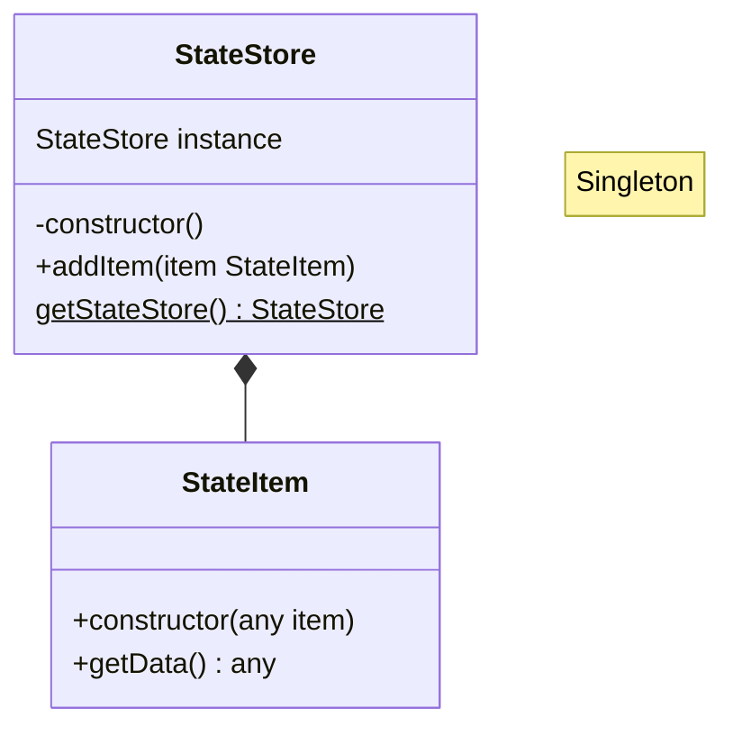

```mermaid
classDiagram
    note "Singleton"
    class StateStore {
        -constructor()
        StateStore instance
        +addItem(item StateItem)
        getStateStore() StateStore$
    }
    class StateItem {
        +constructor(any item)
        +getData() any
    }
    StateStore *-- StateItem
```