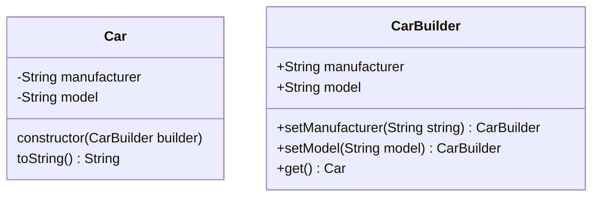

```mermaid
classDiagram
%%    note "Builder"
    class Car {
        -String manufacturer
        -String model
        constructor(CarBuilder builder)
        toString() String
    }
    class CarBuilder {
        +String manufacturer
        +String model
        +setManufacturer(String string) CarBuilder
        +setModel(String model) CarBuilder
        +get() Car
    }
```